<div align="center">

# SteelPlant Maintenance Wizard

### AI-Powered Maintenance Decision Support for Steel Manufacturing

**Powered by ForgeMind** — Agentic AI · Predictive Maintenance · RAG · Multi-Agent Reasoning

[](backend/)
[](frontend/)
[](backend/app/services/agents/)
[](data/cmapss/)
[](#)

*An intelligent maintenance command center — not a document chatbot.*

**Demo login:** `engineer@steelplant.com` / `demo1234`

</div>

---

## Table of Contents

| # | Section |
|---|---------|
| 1 | [Executive Summary](#1-executive-summary) |
| 2 | [System Architecture](#2-system-architecture) |
| 3 | [Technology Stack](#3-technology-stack) |
| 4 | [Data Flow & System Flow](#4-data-flow--system-flow) |
| 5 | [Model Design & Reasoning Pipeline](#5-model-design--reasoning-pipeline) |
| 6 | [Alerting & Prediction Logic](#6-alerting--prediction-logic) |
| 7 | [Application Modules](#7-application-modules) |
| 8 | [Install, Configure & Run](#8-install-configure--run) |
| 9 | [Sample Input & Output](#9-sample-input--output) |
| 10 | [Assumptions & Limitations](#10-assumptions--limitations) |
| 11 | [API Reference](#11-api-reference) |
| 12 | [Project Structure](#12-project-structure) |
| 13 | [Submission Deliverables](#13-submission-deliverables) |

> **Note for reviewers:** This README is the primary technical document for the hackathon submission. The app includes an in-app **How It Works** guide (`/how-it-works`). Cloud deployment configs (`render.yaml`, `vercel.json`) are included for optional future hosting — **local run is sufficient for evaluation**.

---

## 1. Executive Summary

Steel manufacturing plants depend on complex, interdependent equipment. Unplanned downtime causes production loss, safety risks, and rising maintenance costs. Engineers today juggle manuals, SOPs, sensor alerts, delay logs, and tribal knowledge — often manually.

**SteelPlant Maintenance Wizard** consolidates these inputs into one **AI Maintenance Command Center** that:

| Capability | How |
|------------|-----|
| Diagnose faults | Multi-agent RCA with sensor evidence + document citations |
| Predict failures | XGBoost RUL + Isolation Forest anomaly detection on C-MAPSS data |
| Prioritise the fleet | Composite risk scoring (criticality × RUL × spares × delays) |
| Plan maintenance | Immediate / short / long-term actions with spare-aware procurement |
| Explain decisions | AI Reasoning Panel, agent traces, confidence scores, PDF reports |
| Learn from feedback | Engineer 👍/👎 stored and applied to future recommendations |

**Monitored fleet (5 assets, each mapped 1:1 to NASA C-MAPSS FD001 engine unit):**

| Code | Asset | C-MAPSS Unit | Criticality |
|------|-------|--------------|-------------|
| BF-001 | Blast Furnace Blower | U1 | Critical |
| RM-002 | Rolling Mill Motor | U2 | Critical |
| CP-003 | Coke Oven Compressor | U3 | High |
| CW-004 | Cooling Water Pump | U4 | Medium |
| CN-005 | Continuous Caster Drive | U5 | Critical |

---

## 2. System Architecture

### 2.1 High-Level Architecture

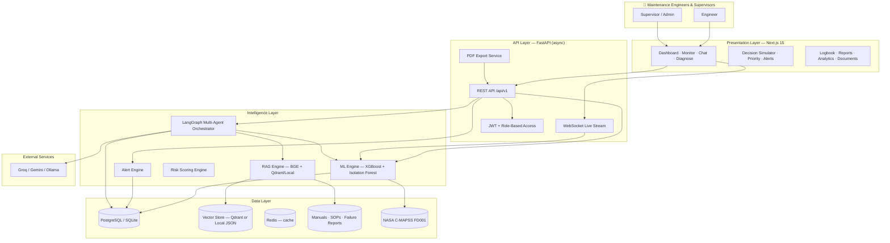

### 2.2 Layer Responsibilities

```mermaid
graph LR
    subgraph L1["Layer 1 — Experience"]
        A1[20+ UI pages]
        A2[Role-based views]
        A3[Real-time charts]
    end
    subgraph L2["Layer 2 — Services"]
        B1[Equipment & Sensors]
        B2[Chat & Diagnose]
        B3[Reports & Logbook]
    end
    subgraph L3["Layer 3 — AI/ML"]
        C1[10 LangGraph agents]
        C2[RUL + Anomaly models]
        C3[Hybrid RAG retrieval]
    end
    subgraph L4["Layer 4 — Persistence"]
        D1[18 DB tables]
        D2[Vector embeddings]
        D3[Model artifacts .joblib]
    end
    L1 --> L2 --> L3 --> L4
```

### 2.3 Database Entity Relationship (Core)

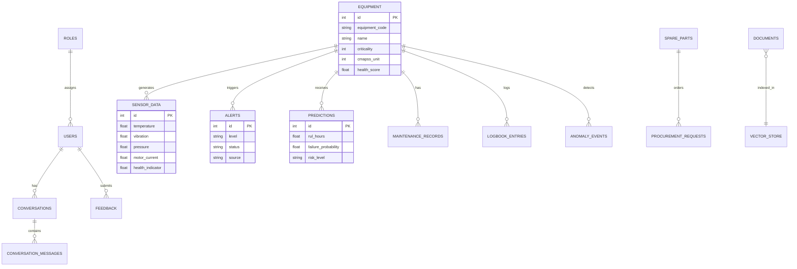

---

## 3. Technology Stack

### 3.1 Stack Overview Diagram

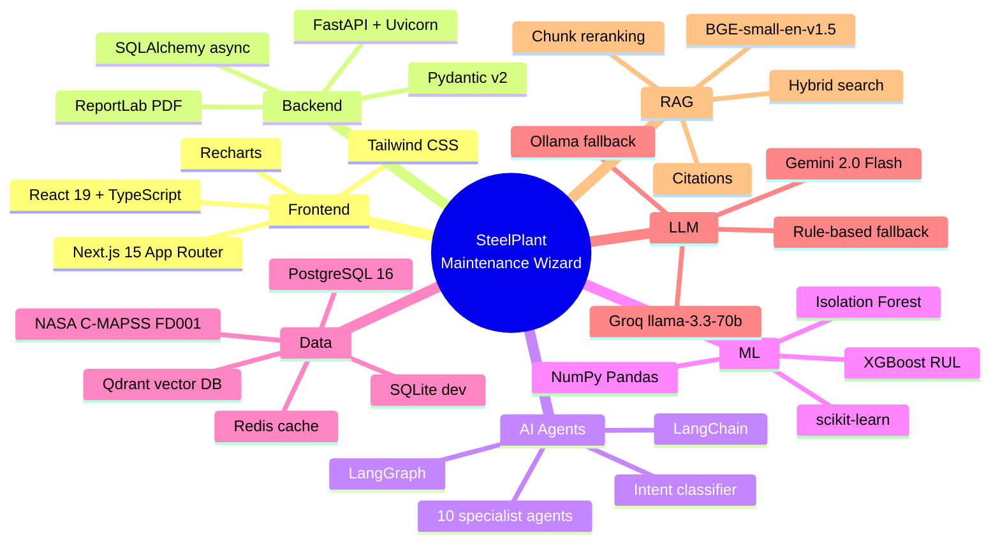

### 3.2 Detailed Stack Table

| Layer | Technology | Purpose |
|-------|-----------|---------|
| **Frontend** | Next.js 15, React 19, TypeScript, Tailwind CSS, Recharts | Dashboard, live monitor, chat, simulator, reports |
| **Backend** | FastAPI, Uvicorn, SQLAlchemy (async), Pydantic v2 | REST API, WebSocket, auth, business logic |
| **Database** | PostgreSQL 16 (prod) / SQLite (local dev) | Equipment, sensors, alerts, conversations, feedback |
| **Vector DB** | Qdrant + local JSON fallback | Document embeddings for RAG |
| **Embeddings** | `BAAI/bge-small-en-v1.5` (384-dim) | Semantic search over manuals/SOPs |
| **Agent framework** | LangGraph | Supervisor + specialist agent orchestration |
| **LLMs** | Groq, Gemini, Ollama, rule-based | Natural language synthesis with fallback chain |
| **ML — RUL** | XGBoost regressor | Remaining Useful Life prediction |
| **ML — Anomaly** | Isolation Forest | Unsupervised abnormality detection |
| **Dataset** | NASA C-MAPSS FD001 | Turbofan degradation → steel plant sensor replay |
| **Auth** | JWT (python-jose), bcrypt | Role-based access (engineer / supervisor / admin) |
| **Reports** | ReportLab | PDF export for diagnosis, alerts, priority, executive |
| **Observability** | structlog, OpenTelemetry hooks | Structured logging and monitoring hooks |
| **Container** | Docker Compose | Optional Postgres + Qdrant + Redis + backend |

---

## 4. Data Flow & System Flow

### 4.1 End-to-End System Flow

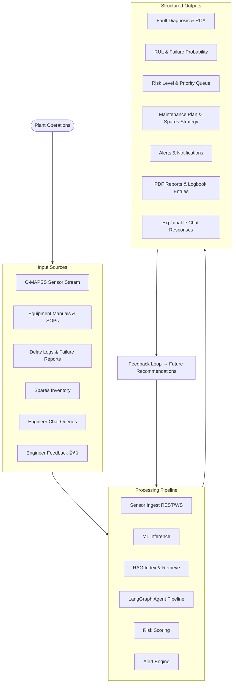

### 4.2 Condition Monitoring Flow

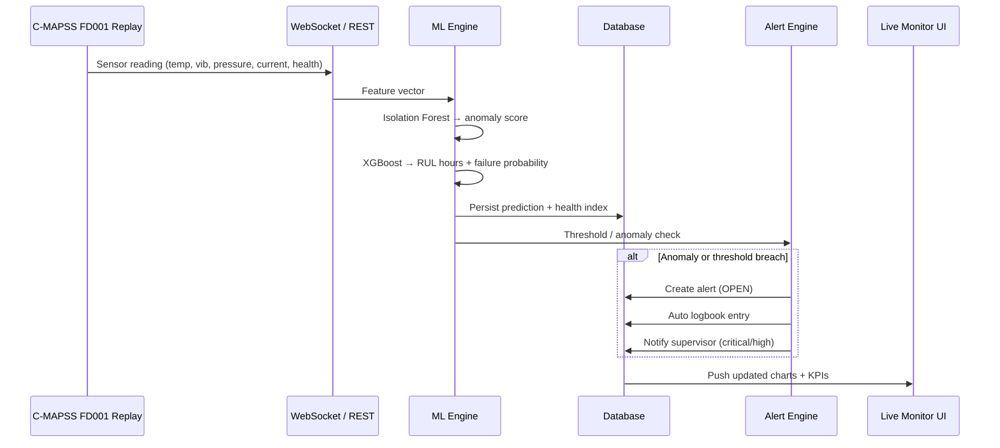

### 4.3 Knowledge / RAG Flow

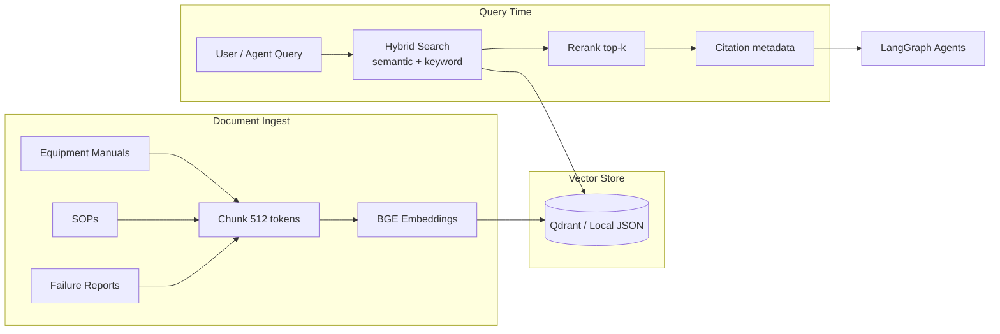

### 4.4 Conversational Flow (ForgeMind)

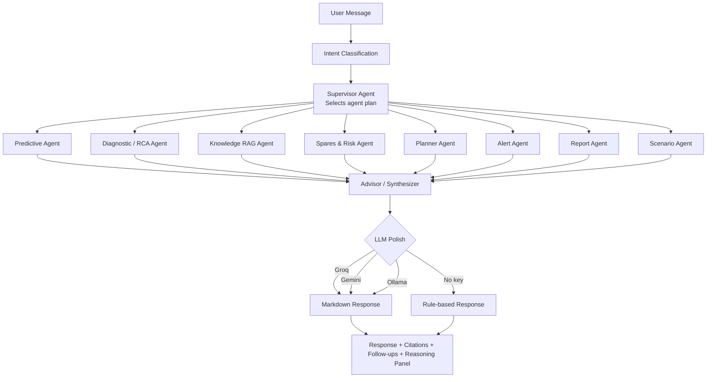

---

## 5. Model Design & Reasoning Pipeline

### 5.1 ML Model Architecture

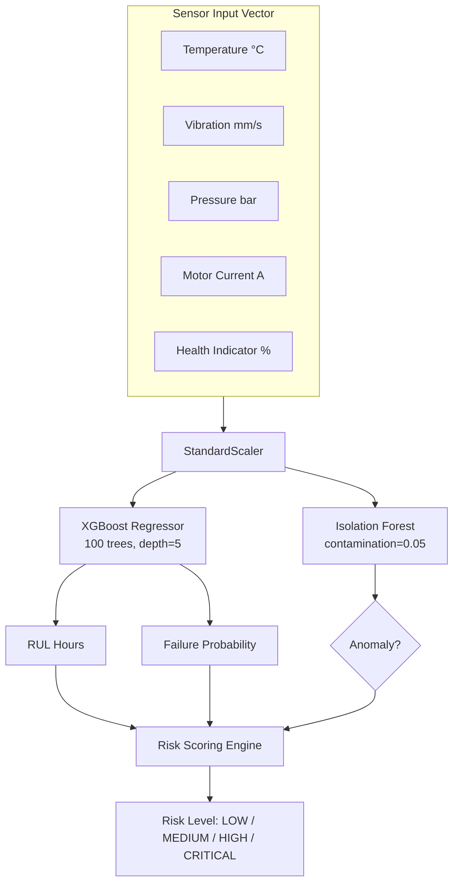

**Training data:** NASA C-MAPSS FD001 — 20,631 samples across 100 engine units  
**Model metrics (stored in `backend/models/train_metrics.json`):**

| Metric | Value |
|--------|-------|
| Dataset | NASA C-MAPSS FD001 |
| RUL MAE | ~168 hours |
| Engines | 100 |
| Model version | xgb-cmapss-v1 |

Models auto-train on first boot if `.joblib` artifacts are missing.

### 5.2 Risk Scoring Formula (Composite)

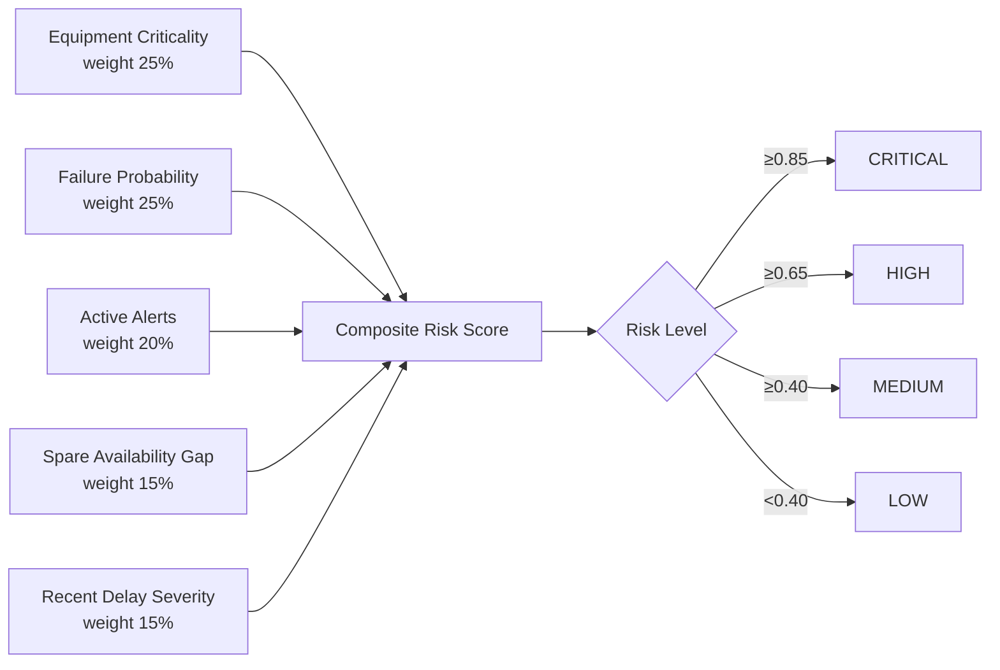

**Procurement escalation rule:** If `RUL < spare lead time` → risk automatically escalates (e.g. HIGH → CRITICAL).

### 5.3 Multi-Agent Reasoning Pipeline

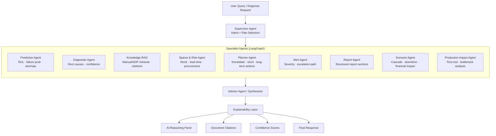

| Agent | Input | Output |
|-------|-------|--------|
| **Supervisor** | User intent | Dynamic agent execution plan |
| **Predictive** | Latest sensor snapshot | RUL, failure probability, anomaly flag |
| **Diagnostic (RCA)** | Symptoms + sensors + history | Ranked probable causes with confidence |
| **Knowledge RAG** | Query text | Retrieved passages + citation metadata |
| **Spares & Risk** | Equipment + inventory | Stock status, lead time, procurement risk |
| **Planner** | RUL + risk + SOPs | Maintenance plan (immediate / short / long) |
| **Alert** | Thresholds + risk | Severity recommendation, escalation |
| **Report** | All agent outputs | Structured report JSON for PDF |
| **Scenario** | Asset + delay option | Cascade map, downtime cost, contingency |
| **Advisor** | All evidence | Natural-language grounded answer |

### 5.4 Feedback-Driven Learning Loop

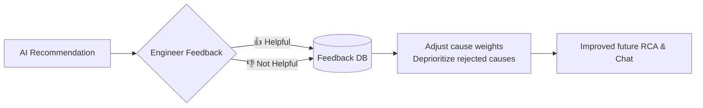

Feedback is captured on **Diagnose**, **Chat**, and **Reports** pages.

---

## 6. Alerting & Prediction Logic

### 6.1 Prediction Pipeline (Every Sensor Ingest)

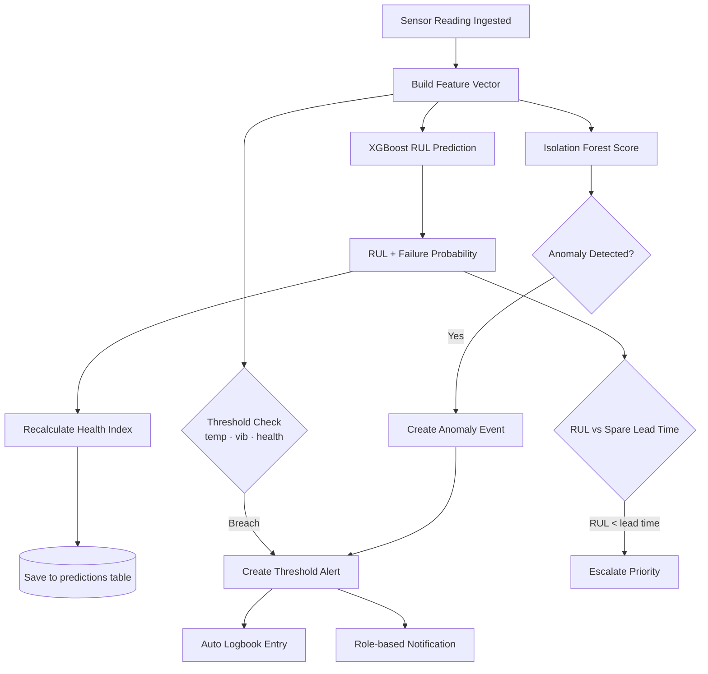

### 6.2 Alert Lifecycle

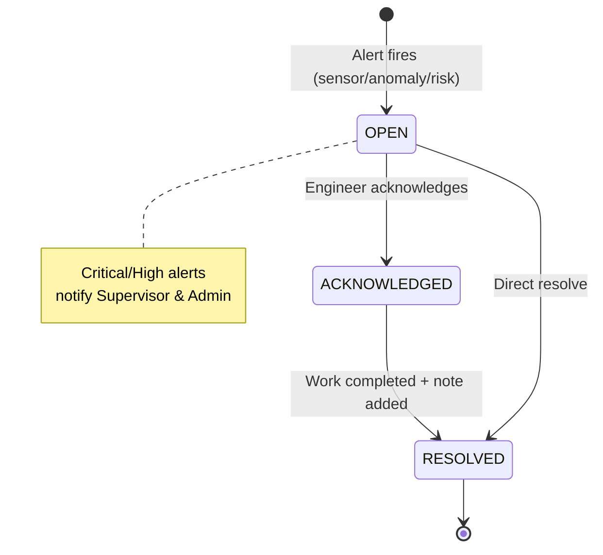

| Alert Level | Trigger Example | Notification |
|-------------|-----------------|--------------|
| **INFO** | Minor sensor deviation | Engineer only |
| **WARNING** | Threshold approaching limit | Engineer dashboard |
| **HIGH** | Sustained vibration/temperature breach | Engineer + in-app notify |
| **CRITICAL** | Anomaly + low RUL + no spares | Supervisor + Admin notified |

### 6.3 LLM Fallback Chain

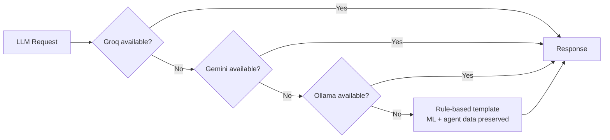

The system **never fails silently** — ML predictions, risk scores, and structured agent outputs are always returned even without an LLM key.

---

## 7. Application Modules

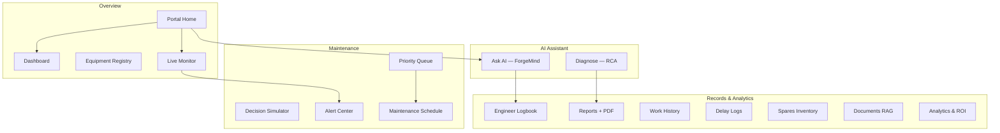

| Module | Route | What it does |
|--------|-------|--------------|
| Portal Home | `/home` | Navigation hub — all modules grouped by Operations / AI / Records |
| Dashboard | `/dashboard` | Fleet KPIs, health overview, top priority assets, open alert banner |
| Equipment | `/equipment` | 5-asset registry with C-MAPSS unit mapping |
| Live Monitor | `/monitor` | Real-time sensor charts (°C, mm/s, bar, A, health %) via WebSocket |
| Ask AI | `/chat` | Multi-turn ForgeMind chat with history, citations, reasoning panel |
| Diagnose | `/diagnose` | Structured fault diagnosis form → RCA + PDF export |
| Decision Simulator | `/simulate` | Delay vs. act-now scenario comparison with financial impact |
| Priority Queue | `/priority` | Fleet ranked by composite risk and RUL |
| Alerts | `/alerts` | Acknowledge / resolve alert workflow |
| Schedule | `/scheduler` | AI maintenance plan + engineer reminders |
| Logbook | `/logbook` | Auto + manual maintenance event records |
| Reports | `/reports` | Generate and download PDF reports |
| Analytics | `/analytics` | Business impact, ROI, executive summary |
| Documents | `/knowledge` | Upload and browse RAG-indexed manuals/SOPs |
| Spares | `/spares` | Inventory, procurement requests, approval workflow |
| How It Works | `/how-it-works` | Architecture transparency for judges |

---

## 8. Install, Configure & Run

### 8.1 Prerequisites

| Requirement | Version |
|-------------|---------|
| Python | 3.11+ |
| Node.js | 18+ |
| npm | 9+ |
| Git | Any recent version |

> First startup takes **1–3 minutes** — database seeding + ML model bootstrap from C-MAPSS FD001.

### 8.2 Quick Start (Local — Recommended for Reviewers)

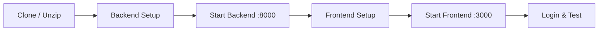

**Terminal 1 — Backend**

```bash
cd steelplant-maintenance-wizard/backend
python3 -m venv .venv
source .venv/bin/activate          # Windows: .venv\Scripts\activate
pip install -r requirements.txt
cp .env.local .env
PYTHONPATH=. uvicorn app.main:app --reload --host 0.0.0.0 --port 8000
```

**Terminal 2 — Frontend**

```bash
cd steelplant-maintenance-wizard/frontend
npm install
npm run dev
```

**Open:** http://localhost:3000  
**Login:** `engineer@steelplant.com` / `demo1234`

**Verify backend:**

```bash
curl http://localhost:8000/health
# Expected: {"status":"healthy", ...}
```

**API docs:** http://localhost:8000/docs

### 8.3 Alternative: Helper Scripts (macOS/Linux)

```bash
# After venv + pip install once:
cd backend && bash scripts/start_backend.sh
cd frontend && bash scripts/start_frontend.sh
```

### 8.4 Docker Option (Optional)

```bash
cd steelplant-maintenance-wizard
docker compose --profile full up --build -d
# Backend: http://localhost:8000/health
# Start frontend separately (see above)
```

### 8.5 Configuration

Copy and edit environment files:

| File | Use case |
|------|----------|
| `backend/.env.local` | Local dev — SQLite, no Docker |
| `backend/.env.docker` | Full Docker stack |
| `.env.example` | Reference for all variables |

**Key environment variables:**

| Variable | Description | Default (local) |
|----------|-------------|-----------------|
| `DATABASE_URL` | Async DB connection | SQLite (`data/spmw.db`) |
| `LLM_PROVIDER` | Active LLM provider | `groq` |
| `GROQ_API_KEY` | Groq API key | — |
| `GEMINI_API_KEY` | Google Gemini key | — |
| `VECTOR_STORE_MODE` | `auto` / `local` / `qdrant` | `auto` |
| `CORS_ORIGINS` | Allowed frontend origins | `localhost:3000` |
| `NEXT_PUBLIC_API_URL` | Backend URL for frontend | `http://localhost:8000/api/v1` |

### 8.6 Run Tests

```bash
cd backend
source .venv/bin/activate
pytest tests/ -v
```

### 8.7 Recommended Demo Flow (5–10 min)

1. **Login** → Portal Home  
2. **Dashboard** → fleet KPIs + open alerts  
3. **Live Monitor** → select RM-002, watch sensor charts  
4. **Alerts** → acknowledge an alert  
5. **Ask AI** → *"What is the RUL for the highest-risk asset?"*  
6. **Diagnose** → enter symptoms + fault codes → view Reasoning Panel  
7. **Decision Simulator** → compare 3-day delay vs. act now  
8. **Reports** → generate + download PDF  
9. **Logbook** → show auto-generated entries  
10. **How It Works** → architecture walkthrough  

### 8.8 GitHub Submission (No Cloud Deploy Required)

For hackathon submission you only need to:

1. Push this repository to GitHub  
2. Include this README as the technical document  
3. Provide a screen recording of the demo flow above  

Optional cloud configs (`render.yaml`, `frontend/vercel.json`) are included for future deployment but **are not required for judges to evaluate the project locally**.

---

## 9. Sample Input & Output

### 9.1 Chat — Fault Diagnosis Query

**Request** `POST /api/v1/chat`

```json
{
  "message": "RM-002 has high vibration and fault E-2041. What is the root cause and what should I do?",
  "equipment_id": 2
}
```

**Response (abridged)**

```markdown
## Summary
RM-002 (Rolling Mill Motor) shows progressive bearing/lubrication degradation.
RUL ~1,770 h · Failure probability 38.3% · Risk: MEDIUM

## Probable Root Causes
1. Bearing wear due to insufficient lubrication (confidence: 78%)
2. Misalignment from thermal expansion (confidence: 52%)

## Recommended Actions
1. Inspect bearing assembly and lubrication system — ASAP
2. Verify spare BRG-6205 availability (lead time: 12 days)
3. Schedule vibration analysis before next production shift

## Citations
- rolling_mill_motor_sop.txt · bearing_failure_report.txt
```

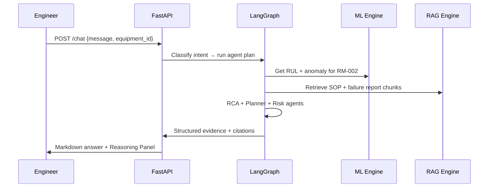

---

### 9.2 Sensor Ingest — Anomaly Detection

**Request** `POST /api/v1/equipment/2/sensors`

```json
{
  "temperature": 95.0,
  "vibration": 8.5,
  "pressure": 120.0,
  "motor_current": 65.0,
  "health_indicator": 45.0
}
```

**Response (abridged)**

```json
{
  "equipment_id": 2,
  "anomaly_detected": true,
  "rul_hours": 420.5,
  "failure_probability": 0.61,
  "health_score": 45.0,
  "risk_level": "high",
  "alert_created": true,
  "alert": {
    "title": "High vibration detected on RM-002",
    "level": "high",
    "status": "open"
  }
}
```

---

### 9.3 Structured Diagnosis

**Request** `POST /api/v1/diagnose`

```json
{
  "equipment_id": 2,
  "symptoms": "Abnormal vibration, rising temperature, motor current spike",
  "fault_codes": ["E-2041", "VIB-HIGH"],
  "incident_description": "Operator reported grinding noise during rolling pass"
}
```

**Response includes:** ranked root causes · confidence scores · maintenance plan · spare procurement flags · document citations · AI Reasoning Panel JSON · PDF export URL

---

### 9.4 Decision Simulator

**Request** `POST /api/v1/scenarios/simulate`

```json
{
  "equipment_id": 1,
  "delay_hours": 72,
  "mode": "delay"
}
```

**Response highlights:**

| Field | Example Value |
|-------|---------------|
| Failure probability after delay | 67% |
| Production loss | 840 Tons |
| Financial impact | ₹42.5L |
| Affected downstream assets | RM-002, CP-003 |
| Recommendation | **Act within 24h** — spare lead time exceeds remaining RUL |

---

### 9.5 Priority Queue

**Request** `GET /api/v1/priority`

**Response (abridged)**

```json
[
  {
    "equipment_code": "BF-001",
    "name": "Blast Furnace Blower",
    "rul_hours": 96,
    "risk_level": "critical",
    "recommended_action": "IMMEDIATE SHUTDOWN & REPAIR",
    "spare_risk": "Bearing stock: 0 · Lead time: 14 days"
  },
  {
    "equipment_code": "RM-002",
    "rul_hours": 420,
    "risk_level": "high",
    "recommended_action": "URGENT: Schedule within 24h"
  }
]
```

---

## 10. Assumptions & Limitations

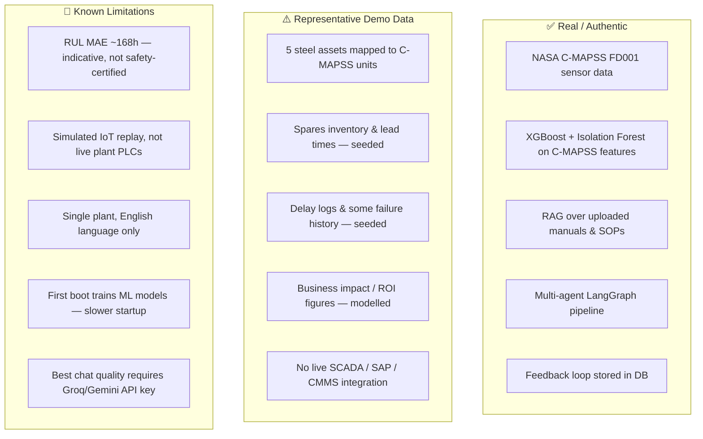

| Category | Detail |
|----------|--------|
| **IoT data** | C-MAPSS FD001 replayed over WebSocket simulates live plant sensors — not connected to real SCADA |
| **Operational data** | Spares, delays, and some history are seeded for demo workflows |
| **ML accuracy** | RUL model MAE ≈ 168 hours on C-MAPSS FD001; production would retrain on plant-specific data |
| **LLM** | Groq/Gemini optional; system degrades gracefully to ML + rule-based responses |
| **Scope** | Single-plant, English; no real Tata Steel production system integration in this prototype |
| **Security** | Demo credentials only — production requires proper IAM and secret management |

---

## 11. API Reference

| Method | Endpoint | Description |
|--------|----------|-------------|
| `POST` | `/api/v1/auth/login` | JWT authentication |
| `GET` | `/api/v1/equipment` | Fleet list |
| `GET` | `/api/v1/equipment/dashboard` | Plant KPI summary |
| `GET` | `/api/v1/equipment/priority` | Risk-ranked priority queue |
| `POST` | `/api/v1/equipment/{id}/sensors` | Ingest sensor reading → ML + alerts |
| `GET` | `/api/v1/equipment/{id}/predictions` | Latest RUL / failure probability |
| `POST` | `/api/v1/chat` | ForgeMind multi-agent chat |
| `POST` | `/api/v1/diagnose` | Structured root-cause analysis |
| `GET` | `/api/v1/alerts` | Alert feed (filter: open/all/resolved) |
| `POST` | `/api/v1/alerts/{id}/acknowledge` | Acknowledge alert |
| `POST` | `/api/v1/alerts/{id}/resolve` | Resolve alert |
| `GET` | `/api/v1/spares` | Spares inventory |
| `POST` | `/api/v1/procurement` | Submit procurement request |
| `POST` | `/api/v1/scenarios/simulate` | Decision simulator |
| `GET` | `/api/v1/analytics/plant` | Business impact analytics |
| `POST` | `/api/v1/reports/pdf/export` | PDF report download |
| `POST` | `/api/v1/feedback` | Submit 👍/👎 feedback |
| `WS` | `/api/v1/ws/monitor/{id}` | Live C-MAPSS sensor stream |

Interactive Swagger UI: **http://localhost:8000/docs**

---

## 12. Project Structure

```
steelplant-maintenance-wizard/
├── backend/
│   ├── app/
│   │   ├── api/routes/          # REST endpoints
│   │   ├── core/                # Config, fleet, security
│   │   ├── models/              # SQLAlchemy ORM + .joblib ML artifacts
│   │   ├── services/
│   │   │   ├── agents/          # LangGraph orchestrator + reasoning panel
│   │   │   ├── ml/              # XGBoost, Isolation Forest, C-MAPSS loader
│   │   │   ├── rag/             # Knowledge engine + vector store
│   │   │   ├── alerts/          # Alert engine
│   │   │   └── reports/         # PDF generation
│   │   └── db/                  # Bootstrap, seed, session
│   ├── scripts/                 # Train models, seed data, start_backend.sh
│   └── tests/                   # API + ML tests
├── frontend/
│   └── src/
│       ├── app/                 # Next.js pages (20 routes)
│       └── components/          # UI, charts, chat, reasoning panel
├── data/
│   ├── cmapss/                  # NASA C-MAPSS FD001 files
│   └── documents/               # Manuals, SOPs, failure reports
├── docs/                        # ARCHITECTURE.md, DEPLOYMENT.md
├── docker-compose.yml
├── Dockerfile
├── render.yaml                  # Optional cloud backend blueprint
└── README.md                    # This document
```

---

## 13. Submission Deliverables

| Hackathon Deliverable | Location |
|-----------------------|----------|
| Working prototype source code | `backend/` + `frontend/` |
| System architecture | [§2](#2-system-architecture) + `docs/ARCHITECTURE.md` |
| Technology stack | [§3](#3-technology-stack) |
| Data flow & system flow | [§4](#4-data-flow--system-flow) |
| Model design & reasoning pipeline | [§5](#5-model-design--reasoning-pipeline) |
| Alerting & prediction logic | [§6](#6-alerting--prediction-logic) |
| Assumptions & limitations | [§10](#10-assumptions--limitations) |
| Install / configure / run | [§8](#8-install-configure--run) |
| Sample input & output | [§9](#9-sample-input--output) |
| In-app user guide | `/how-it-works` page |
| Screen recording | _3–5 min demo following [§8.7](#87-recommended-demo-flow-510-min)_ |

---

<div align="center">

**SteelPlant Maintenance Wizard** · Tata Round 2 Hackathon  
*Built for steel manufacturing reliability — explainable, actionable, demo-ready.*

</div>
